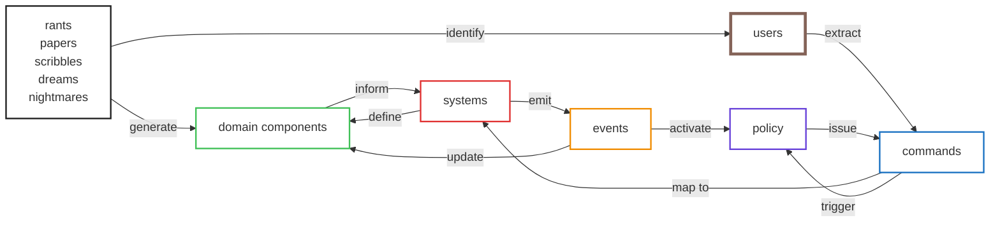

# Getting Dizzy

## Core Principals

- Command Query Responsability Seperation
- Event Sourcing
- Dependency Injection
- Command Queueing
- Entity Component Systems

## Suggested Stack (for now)

- LinkML
- Python
- Incus - https://linuxcontainers.org/incus/docs/main/

## Dreams...

- ESP32 integration

## Event Storming

You should have

- Users
- Commands
- Domain Events
- Domain Entities
- Policies
- Procedures

## Refining and Optimizing

- Telemetry
- Queries
- Mutations

# Reference?

